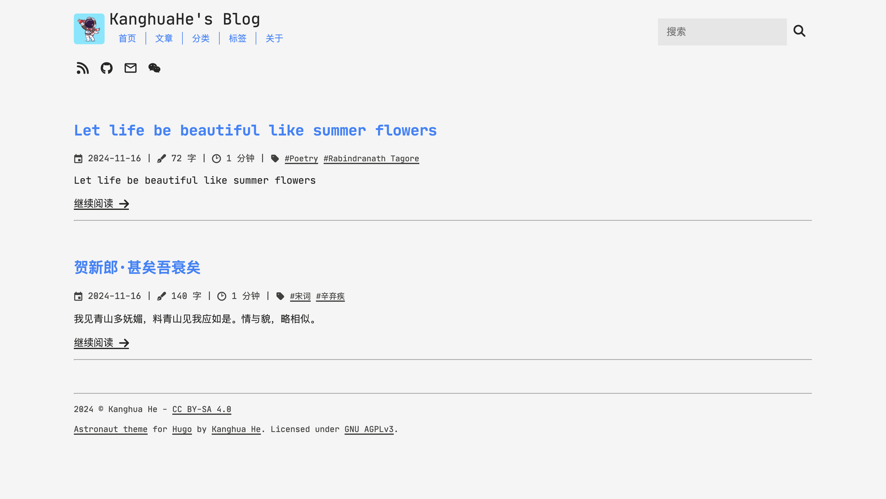

# Astronaut

Astronaut 是一个简约、漂亮且功能完善的 Hugo 博客主题。

> 该主题源自于 [Gabriele Musco](https://gabmus.org/) 的 [hugo-ficurinia](https://gitlab.com/gabmus/hugo-ficurinia) 主题，Astronaut 是在其基础上简化和改进而来的。在此非常感谢 Gabriele Musco 对其主题的精心打磨。



## 站点配置

在Hugo站点配置文件 `hugo.toml` 中，添加下面的参数可以定制 Astronaut 的一些功能。

```toml
# 站点的根 URL
baseURL = "https://example.com/"

# 主题
theme = "hugo-astronaut"

# 站点标题
title = "My Blog"

# 站点的语言标识码用于表示当前站点使用的语言
# 默认为英文（en）
languageCode = "en"

# 站点内容语言用于控制主题内词条以何种语言展示
# 目前主题内只支持：中文（zh）和英文（en）
# 默认为英文（en）
defaultContentLanguage = "en"

# 内容的版权信息
# 版权信息将展示在页脚形如：2024 © copyright
# 版权信息支持 Markdown 语法
copyright = "Some copyright notice - [my license](https://example.com/license)"

# 单页文章个数
[pagination]
  pagerSize = 5

# 文章摘要字数
summaryLength = 70

# 自动识别中文（Chinese）日文（Japanese）韩文（Korean）以便准确判断这三种文字的摘要长度和文章字数
hasCJKLanguage = true


[params]

    # Meta信息（SEO优化）
    author = "Kanghua He"  # 文章作者
    description = "A description for my website"  # 站点描述信息

    # 文章内容目录
    posts = "posts"  # 首页文章将从这个目录中获取（默认值: "posts" 或 "post"）

    # 站点图标（按照下面的命名方式将指定大小的图标放在站点的 "static" 目录中）
    logo = "/logo.svg"
    favicon = "/favicon.png"  # 32x32
    faviconIco = "/favicon.ico"  # 32x32
    appletouch = "/apple-touch-icon.png"  # 180x180
    svgicon = "/logo.svg"
    icon512 = "/icon512.png"  # 512x512

    # 图标在标题右侧展示
    logoRightOfTitle = false  # 默认值: false

    # 展示 RSS 菜单图标
    showRss = true  # 默认值: true

    # 图片在文章预览页面中展示
    imageInArticlePreview = false  # 默认值: false

    # 调整图片大小以适配文章预览（非裁剪）
    fitImageInArticlePreview = false  # 默认值: false

    # 文章预览页面展示文章摘要
    articleSummary = true  # 默认值: true
    
    # 字体
    fontFamily = "JetBrains Mono"  # 默认值: "JetBrains Mono"
    titleFontFamily = "JetBrains Mono"  # 标题和头部字体 默认值: "JetBrains Mono"
    monospaceFontFamily = "JetBrains Mono"  # 代码块字体 默认值: "JetBrains Mono"

    # 字体大小（放大或缩小倍数）
    titleFontSizeMultiplier = 1.0  # 标题字体大小
    mainFontSizeMultiplier = 1.0  # 页面内容字体大小
    monoFontSizeMultiplier = 1.2  # 代码字体大小

    # 文章内容宽度
    contentWidth = "1200px"

    # 卡片风格展示文章列表
    paperCards = false  # 默认值: false

    # 卡片风格中使用网格布局展示文章列表
    gridView = false  # 默认值: false

    # 按钮风格展示文章内容中的标签
    buttonTags = false  # 默认值: false

    # 文章预览页面展示文章的标签
    tagsInArticlePreview = true  # 默认值: true

    # 文章内容页面是否展示大标题
    bigArticleTitle = false  # 默认值: false

    # 分页按钮样式
    navtype = "standard"  # 可用样式: "standard", "circles" 默认值: "standard"
    
    # 菜单栏样式
    menuStyle = "standard"  # 可用样式: "standard", "buttons" 默认值: "standard"
    
    # 输入框样式
    inputStyle = "standard"  # 可用样式: "standard", "buttons" 默认值: "standard"

    # 开启搜索
    enableSearch = true  # 默认值: true

    # 任何页面都展示搜索框
    searchbarEverywhere = true  # 默认值: true

    # 小屏幕浏览时使用汉堡菜单风格
    mobileHamburgerNav = false  # 默认值: false

    # 文章预览页面展示精选文章样式（对应文章 frontmatter 中要配置 featured: true）
    enableFeatured = false  # 默认值: false

    # 文章标题显示下划线
    underlineTitleLinks = false  # 默认值: false

    # 使用 Umami 进行网站分析（需要在 Umami 网站上获取下面的配置信息）
    umamiScriptUrl = "https://something.com/..."
    umamiWebsiteId = "example-tracking-code"

    # 文章内容页面中 TOC 内容在图片之前
    tocBeforeImage = false  # 默认值: false

    # 侧边栏布局
    enableSidebarLayout = false  # 默认值: false

    # TOC 在侧边栏显示
    # 需要开启 enableSidebarLayout = true
    tocInSidebar = false  # 默认值: false

    # 强制重定向
    forceRedirect = false

    # 无限滚动
    # 无限滚动模式替换分页模式（需要在 [outputs] 中配置输出 JSON 格式）
    infiniteScrolling = false

    # 页脚信息栏
    enableFooterColumns = false  # 默认值: false

# 导航栏菜单
[menu]
    # 菜单（可以自定义添加其他菜单）
    [[menu.main]]
        name = "Home"
        identifier = "home"  # identifier 用于获取菜单的 i18n 词条
        url = "/"  # 跳转地址（相对路径）
        weight = 10  # 控制菜单排列顺序
    [[menu.main]]
        name = "Posts"
        identifier = "posts"
        url = "/posts"
        weight = 20
    [[menu.main]]
        name = "Categories"
        identifier = "categories"
        url = "/categories"
        weight = 30
    [[menu.main]]
        name = "Tags"
        identifier = "tags"
        url = "/tags"
        weight = 40
    [[menu.main]]
        name = "About"
        identifier = "about"
        url = "/about"
        weight = 50

    # 图标菜单
    [[menu.icons]]
        identifier = "github"  # identifier 用于在主题目录的 data/supported_icons.yml 文件中获取内置的图标
        name = "GitHub"
        url = "https://github.com/kanghuahe"  # 跳转地址（可以是相对地址也可以是绝对地址）
        weight = 10
    [[menu.icons]]
        identifier = "email"
        name = "Email"
        url = "mailto://kanghuahe.dx@gmail.com"
        weight = 20

# 开启了无限滚动则必须配置 JSON 输出
# 这样就可以通过 JavaScript 访问 JSON 格式的文章内容
[outputs]
    home = ["HTML", "JSON"]

# 配置 Disqus 网站中生成的 shortname 就可以开启文章评论功能
[services]
  [services.disqus]
    shortname = 'xxx'
```

### 支持的图标
主题中为 `[[menu.icons]]` 图标菜单内置了一些图标，可以通过 identifier 匹配对应图标。下面是一些支持的图标标识：
- discord
- email
- facebook
- github
- gitlab
- instagram
- linkedin
- phone
- rss
- steam
- telegram
- twitter
- youtube
- wechat

## 主题颜色

主题的颜色可以完全自定义配置。在主题的 [`data/colors.yml`](data/colors.yml) 中定义的颜色的配置。只需要将该文件复制到你的站点下的 `data/colors.yml` 文件中，然后通过修改该文件自定义主题颜色。

## 页脚信息栏

如果需要在页脚展示一些链接信息，那么可以在你的站点中新建 `data/footer_columns.yml` 配置文件，同时在站点配置中开启 `enableFooterColumns = true` 。然后可以按照下面的示例配置需要展示的链接信息。

```yaml
- title: My other projects
  links:
    - title: Project1
      link: https://project1.com
    - title: Project2
      link: https://project2.com
- title: About me
  links:
    - title: My personal website
      link: https://mysite.com
    - title: My GitHub
      link: https://github.com/mygithubxxx
```

# 文章参数
每篇文章都会在 frontmatter 配置一些参数用于描述文章的基本信息和开启一些特定的功能。

- `title`: 文章标题。
- `date`: 日期时间，通常是创建文件时自动生成。
- `description`: 文章描述（预览时的文章摘要默认使用此内容，此内容为空时会选择正文内容作为文章摘要）。
- `tags`: 文章标签（数组类型）。
- `categories`: 文章分类（数组类型）。
- `image`: 文章图片（在预览和精选时会展示）。
- `alt`: 图片不存在时展示的文本。
- `imageCaption`: 图片下方的标题（MarkDown 格式渲染）。
- `featured`: 默认: false，标注文章为精选。
- `comments`: 默认: true，开启文章评论（使用 Disqus）。
- `showMetaInfo`: 默认: true，展示日期、字数、阅读时间等信息（适用于非文章页面）。
- `showTitle`: 默认: true，隐藏标题。
- `norss`: 默认: false，不添加到RSS。
- `nosearch`: 默认: false，不可搜索。
- `toc`: 默认: false，展示文章内容目录。

## 文章内容目录
可以在站点的配置文件 `hugo.toml` 中配置文章内容目录的展示格式，可以配置展示文章中哪个级别范围的的标题内容。

```toml
[markup]
  [markup.tableOfContents]
    endLevel = 5
    ordered = false
    startLevel = 2
```